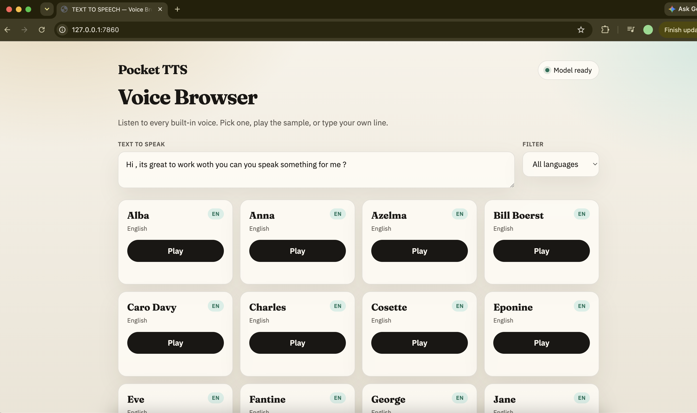
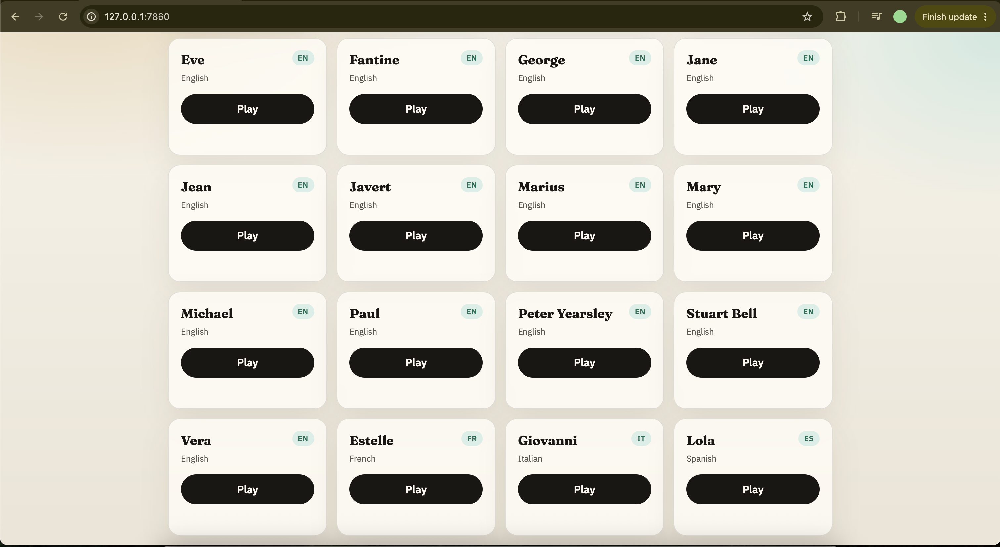
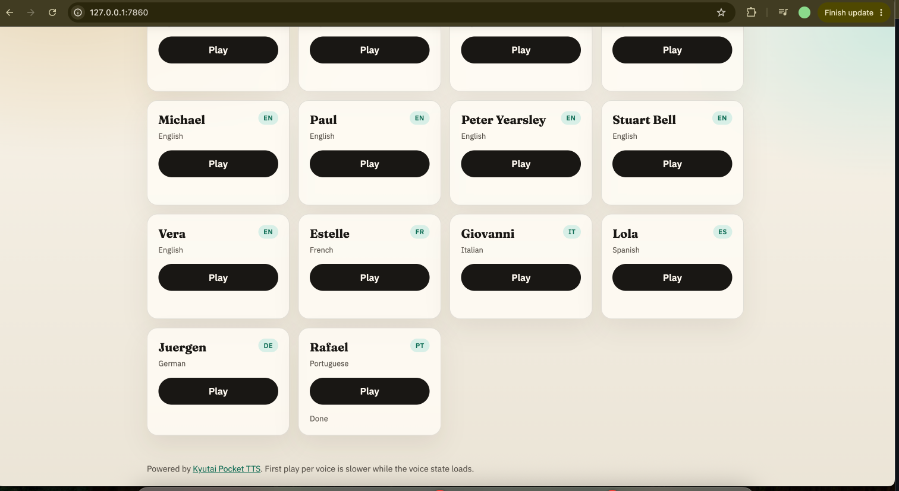

# Pocket TTS — Voice Browser

A local web app to listen to every built-in [Pocket TTS](https://github.com/kyutai-labs/pocket-tts) voice.

## Screenshots

### Home — pick a voice and play



### Voice catalog



### Multilingual voices



## Run

```bash
cd ~/Desktop/Pocket-tts
uv sync
uv run python app.py
```

Then open **http://127.0.0.1:7860**

First launch downloads the model weights (needs internet). After that it runs fully offline on CPU.

## What you can do

- Browse all 26 catalog voices (EN / FR / IT / ES / DE / PT)
- Filter by language
- Play each voice’s default sample
- Type custom text and hear it in any voice

## Notes

- The first **Play** for each voice is slower (voice state loads once, then is cached)
- Keep the terminal open while using the browser
- Stop with `Ctrl+C`
